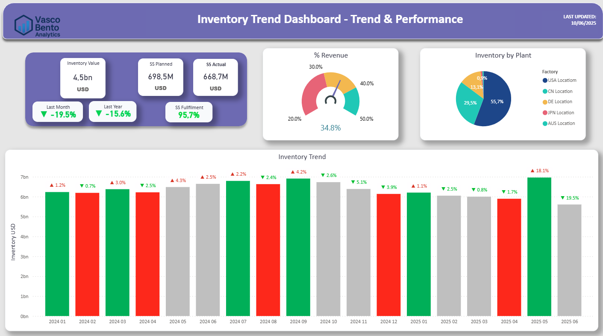

# Inventory Trend Dashboard — Trend & Performance

A Power BI mockup designed for monitoring global inventory evolution and performance — tracking value trends, safety stock fulfillment, plant-level distribution, and strategic KPIs. Combines analytical storytelling with dynamic visuals to highlight key insights and performance shifts.

## Key Features

- **Dynamic KPI Cards**: Inventory Value, SS Planned vs Actual, Fulfillment %, and monthly/yearly variation with red/green arrows.
- **Color-Coded Trend Analysis**: Automatic bar coloring (grey/green/red) based on inventory trend inflection points.
- **% of Revenue Gauge**: Puts inventory in context of revenue weight.
- **Inventory by Plant**: Visual distribution across global locations.
- **Inventory Trend Chart**: Annotated bar chart showing % changes and highlighting upward/downward movements.

## 📸 Dashboard Preview

## Sample DAX Scripts

- `Inventory Index`: `RANKX` to create date-based ordering
- `Trend Color`: logic to assign grey/red/green based on trend inflection
- `Inventory Change Arrow`: arrow + percentage display, colored accordingly
- `% Revenue`: gauge calculation
- `SS Fulfillment %`: conditional card formatting

## ⚙ About the Project

This dashboard is a fictional (mockup) Power BI project developed to showcase inventory trend analysis and KPI storytelling in a global supply chain context. Based on SAP MM & FI structure. All data is anonymized and simulated.

---

**Author**: Vasco Bento  
[LinkedIn](https://www.linkedin.com/in/vasco--bento)

> For demonstration and portfolio purposes only.
